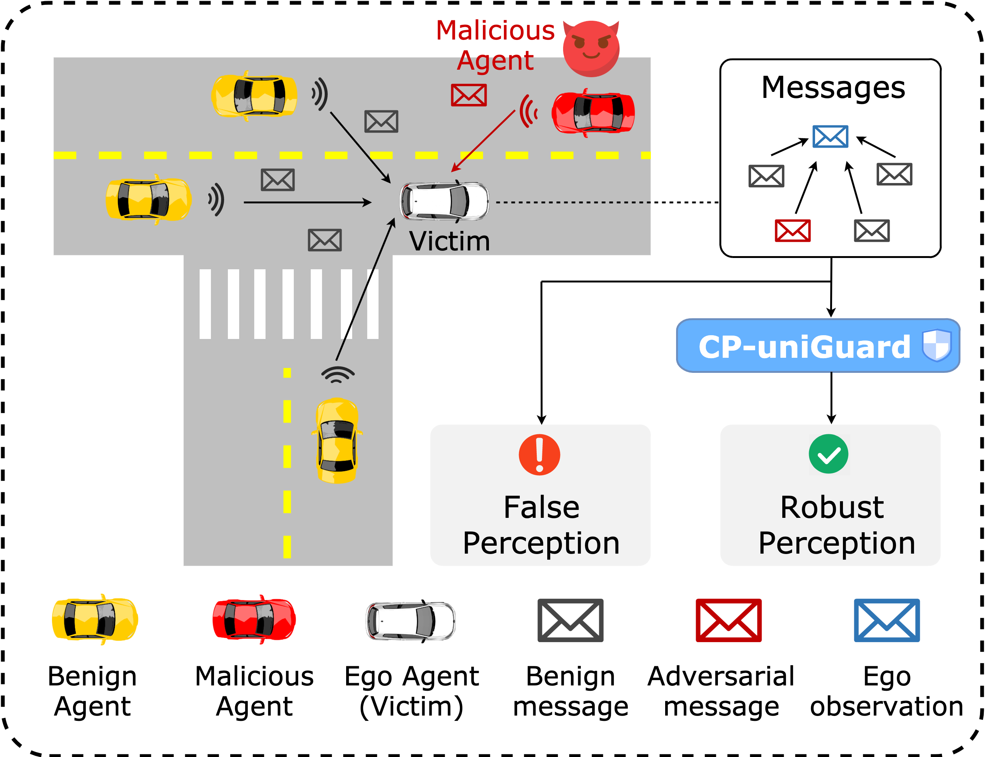

# [TMC] CP-uniGuard: A Unified, Probability-Agnostic, and Adaptive Framework for Malicious Agent Detection and Defense in Multi-Agent Embodied Perception Systems
[Senkang Hu](https://scholar.google.com/citations?user=rtPVwT8AAAAJ), [Yihang Tao](https://scholar.google.com/citations?user=YopoapwAAAAJ), [Guowen Xu](https://scholar.google.com/citations?user=MDKdG80AAAAJ), [Xinyuan Qian](https://scholar.google.com/citations?user=lherf_kAAAAJ), [Yiqin Deng](https://scholar.google.com/citations?user=EdRi_MEAAAAJ), [Xianhao Chen](https://scholar.google.com/citations?user=TnjiGooAAAAJ), [Sam Tak Wu Kwong](https://scholar.google.com/citations?user=_PVI6EAAAAAJ), [Yuguang Fang](https://scholar.google.com/citations?user=cs45mqMAAAAJ)

**"Unified defense framework against adversarial attacks in multi-agent collaborative perception with adaptive consensus mechanisms"** - Accepted by IEEE Transactions on Mobile Computing (TMC), 

<p align="center"> </p>

## Overview

CP-uniGuard is a unified framework for adversarially robust collaborative perception in autonomous driving scenarios. It provides multiple defense strategies against malicious attacks in multi-agent collaborative perception systems, including:

- **ROBOSAC**: Original sampling-based consensus defense
- **PASAC**: Progressive Agent Selection with Adaptive Consensus using recursive binary splitting ([CP-Guard [AAAI'25 Oral]](https://arxiv.org/abs/2412.12000))
- **Linear Selection**: Individual agent testing with adaptive threshold
- **Adaptive Sampling**: Dynamic consensus set size adjustment

## Key Features

- 🔒 **Multiple Defense Mechanisms**: Support for ROBOSAC, PASAC, Linear, and other consensus-based defenses
- 🎯 **Adaptive Threshold**: Online adaptive threshold with temporal sliding-window quantile for robust agent selection
- ⚔️ **Adversarial Attack Simulation**: Built-in support for PGD, BIM, and CW-L2 attacks
- 📊 **Comprehensive Evaluation**: mAP evaluation, success rate analysis, and visualization
- 🚗 **Autonomous Driving Focus**: Designed for V2X collaborative 3D object detection

## Getting Started

### Installation

See [Installation Guide](docs/Installation.md/#installation) for environment setup.

### Dataset Preparation

See [Dataset Preparation](docs/Installation.md/#dataset-preparation) for V2X-Sim dataset setup.

### Model Checkpoint

See [Specifying Dataset and Model](docs/Installation.md/#specifying-dataset) for checkpoint configuration.

## Usage

### Basic Command Structure

```bash
cd coperception/tools/det/
python cp_uniguard.py [OPTIONS]
```

### Quick Start Examples

#### 1. Upper Bound (Clean Collaboration)
Test with all benign agents, no attackers:
```bash
python cp_uniguard.py \
    -d /path/to/V2X-Sim-det/test \
    --robosac upperbound \
    --scene_id 8 \
    --com mean \
    --resume /path/to/model.pth
```

#### 2. Lower Bound (Ego-only)
Test with only ego agent, no collaboration:
```bash
python cp_uniguard.py \
    -d /path/to/V2X-Sim-det/test \
    --robosac lowerbound \
    --scene_id 8 \
    --com mean \
    --resume /path/to/model.pth
```

#### 3. No Defense (Attacked Baseline)
Test with attackers but no defense:
```bash
python cp_uniguard.py \
    -d /path/to/V2X-Sim-det/test \
    --robosac no_defense \
    --scene_id 8 \
    --number_of_attackers 2 \
    --adv_method pgd \
    --eps 0.5 \
    --adv_iter 15 \
    --com mean \
    --resume /path/to/model.pth
```

#### 4. ROBOSAC Defense
Run original ROBOSAC with sampling-based consensus:
```bash
python cp_uniguard.py \
    -d /path/to/V2X-Sim-det/test \
    --robosac robosac_mAP \
    --scene_id 8 \
    --number_of_attackers 2 \
    --step_budget 5 \
    --box_matching_thresh 0.3 \
    --adv_method pgd \
    --eps 0.5 \
    --com mean \
    --resume /path/to/model.pth
```

#### 5. PASAC with Adaptive Threshold
Run Progressive Agent Selection with Adaptive Consensus:
```bash
python cp_uniguard.py \
    -d /path/to/V2X-Sim-det/test \
    --robosac pasac_mAP \
    --scene_id 8 \
    --number_of_attackers 2 \
    --box_matching_thresh 0.3 \
    --adaptive_alpha 0.2 \
    --adaptive_gamma 0.02 \
    --adaptive_window_size 30 \
    --initial_threshold 0.3 \
    --adv_method pgd \
    --eps 0.5 \
    --com mean \
    --resume /path/to/model.pth
```

#### 6. Linear Agent Selection
Run linear agent testing with adaptive threshold:
```bash
python cp_uniguard.py \
    -d /path/to/V2X-Sim-det/test \
    --robosac linear_mAP \
    --scene_id 8 \
    --number_of_attackers 2 \
    --adaptive_alpha 0.2 \
    --adaptive_gamma 0.02 \
    --adv_method pgd \
    --com mean \
    --resume /path/to/model.pth
```

## Command-Line Arguments

### Data and Model Arguments

| Argument | Default | Description |
|----------|---------|-------------|
| `-d, --data` | `../coperception/V2X-Sim-det/test` | Path to preprocessed sparse BEV test data |
| `--resume` | `../../ckpt/meanfusion/epoch_49.pth` | Path to saved model checkpoint |
| `--batch` | `1` | Batch size |
| `--nworker` | `4` | Number of data loading workers |
| `--num_agent` | `6` | Total number of agents |
| `--no_cross_road` | - | Do not load data of cross roads |

### Defense Mode Arguments

| Argument | Default | Description |
|----------|---------|-------------|
| `--robosac` | (required) | Defense mode: `upperbound` / `lowerbound` / `no_defense` / `robosac_mAP` / `pasac_mAP` / `linear_mAP` / `fix_attackers` / `probing` / `adaptive` / `performance_eval` |
| `--ego_agent` | `1` | ID of ego agent (agent 0 is RSU) |
| `--step_budget` | `3` | Maximum sampling steps per frame |
| `--robosac_k` | `None` | Fixed consensus set size (optional) |
| `--box_matching_thresh` | `0.3` | IoU threshold for validating two detection results |

### Adversarial Attack Arguments

| Argument | Default | Description |
|----------|---------|-------------|
| `--adv_method` | `pgd` | Attack method: `pgd`, `bim`, or `cw-l2` |
| `--eps` | `0.5` | Epsilon (perturbation budget) |
| `--pert_alpha` | `0.1` | Scale of perturbation update |
| `--adv_iter` | `15` | Number of attack iterations |
| `--number_of_attackers` | `1` | Number of malicious attackers |
| `--fix_attackers` | - | Keep attackers fixed across frames |
| `--ego_loss_only` | - | Only use ego loss for perturbation |

### Adaptive Threshold Arguments (PASAC & Linear)

| Argument | Default | Description |
|----------|---------|-------------|
| `--adaptive_alpha` | `0.2` | Smoothing factor for threshold updates |
| `--adaptive_gamma` | `0.02` | Additive compensation for recursive levels |
| `--adaptive_window_size` | `30` | Maximum size of sliding window |
| `--adaptive_min_window_size` | `5` | Minimum samples before computing threshold |
| `--initial_threshold` | `0.3` | Initial threshold value |

### Scene and Frame Arguments

| Argument | Default | Description |
|----------|---------|-------------|
| `--scene_id` | `[8]` | Target evaluation scene(s) |
| `--sample_id` | `None` | Target specific frame (optional) |
| `--use_history_frame` | - | Use previous frame as reference (saves 1 forward pass) |

### Fusion Model Arguments

| Argument | Default | Description |
|----------|---------|-------------|
| `--com` | `mean` | Fusion method: `mean`, `sum`, `max`, `disco`, `when2com`, `v2v`, `cat`, `agent` |
| `--layer` | `3` | Communication layer index |
| `--compress_level` | `0` | Channel compression (2**x) |
| `--only_v2i` | `0` | Only V2I communication |

### Output Arguments

| Argument | Description |
|----------|-------------|
| `--log` | Enable logging to file |
| `--logpath` | Custom log file path |
| `--visualization` | Visualize detection results |

## Defense Modes Explained

### 1. `upperbound` - Clean Collaboration
All agents are benign and collaborate. Serves as performance upper bound.

### 2. `lowerbound` - Ego-only
Only ego agent performs detection without collaboration. Serves as performance lower bound.

### 3. `no_defense` - Attacked Baseline
Attackers are present but no defense is applied. Shows impact of attacks.

### 4. `robosac_mAP` - Original ROBOSAC
Sampling-based defense that randomly samples agent subsets until consensus is reached.

### 5. `pasac_mAP` - Progressive Agent Selection with Adaptive Consensus
Recursive binary splitting algorithm with online adaptive threshold:
- Recursively splits agent set into two halves
- Uses adaptive threshold with temporal sliding-window quantile
- Depth-adjusted threshold for different recursion levels
- More efficient than random sampling

### 6. `linear_mAP` - Linear Agent Testing
Tests each agent individually with ego:
- Linear complexity O(n)
- Uses adaptive threshold
- Suitable for small agent sets

### 7. `fix_attackers` - Fixed Attackers Scenario
Attackers remain constant across frames. Once consensus is found, it is reused.

### 8. `probing` - Attacker Ratio Estimation
Estimates attacker ratio using aggressive-to-conservative probing.

### 9. `adaptive` - Adaptive Sampling
Dynamically adjusts consensus set size based on previous results.

### 10. `performance_eval` - Performance Evaluation
Measures forward pass time without defense overhead.

## Notes

⚠️ **GPU Requirements**: Due to data synchronization issues, defense algorithms cannot be performed under multi-GPU environment. Specify a single GPU if needed:

```bash
CUDA_VISIBLE_DEVICES=0 python cp_uniguard.py [arguments]
```

## Citation

If you find this project useful in your research, please cite:

```bibtex
@ARTICLE{11329182,
  author={Hu, Senkang and Tao, Yihang and Xu, Guowen and Qian, Xinyuan and Deng, Yiqin and Chen, Xianhao and Kwong, Sam Tak Wu and Fang, Yuguang},
  journal={IEEE Transactions on Mobile Computing},
  title={{CP-uniGuard: A Unified, Probability-Agnostic, and Adaptive Framework for Malicious Agent Detection and Defense in Multi-Agent Embodied Perception Systems}},
  year={2025},
  volume={},
  number={01},
  ISSN={1558-0660},
  pages={1-14},
  keywords={Collaboration;Robustness;Feature extraction;Training;Detectors;Autonomous vehicles;Artificial intelligence;Accuracy;Training data;Smart cities},
  doi={10.1109/TMC.2026.3650980},
  url={https://doi.ieeecomputersociety.org/10.1109/TMC.2026.3650980},
  publisher={IEEE Computer Society},
  address={Los Alamitos, CA, USA},
  month=jan
}
```

## Acknowledgment

CP-uniGuard is modified from [coperception](https://github.com/coperception/coperception), [ROBOSAC](https://github.com/coperception/ROBOSAC), and [CP-Guard](https://github.com/CP-Security/CP-Guard) library.

Adversarial attacks (PGD/BIM/CW) are implemented from [adversarial-attacks-pytorch](https://github.com/Harry24k/adversarial-attacks-pytorch) library.

This project would not be possible without these great codebases.

## License

This project is licensed under the MIT License - see the [LICENSE](LICENSE) file for details.
